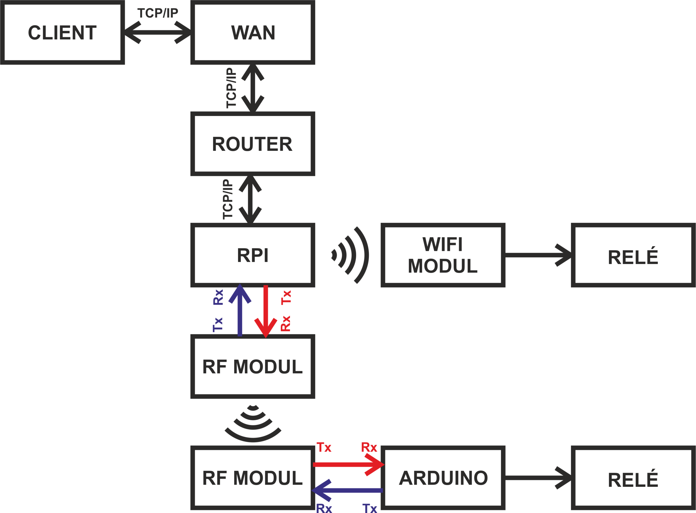
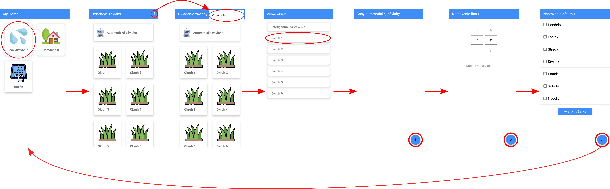

# MyHome
Basically smart-home application. Server side application is written in python (socket-srever), running on Raspberry Pi which than communicates with Arduino devices via RF-module, that are controlling relays. Client side application is written in Java, compatible with Android devices running Andorid 9 and higher. But good scheme is more than a thousand words.

## Communication scheme

## Application scheme

## Protocol
For safety reasons I had to remove all communication strings from scripts. If you want to use this app you will have to replace them with your own communication protocol, which you can write for server side in file [config.conf](./python-server/config.conf).
